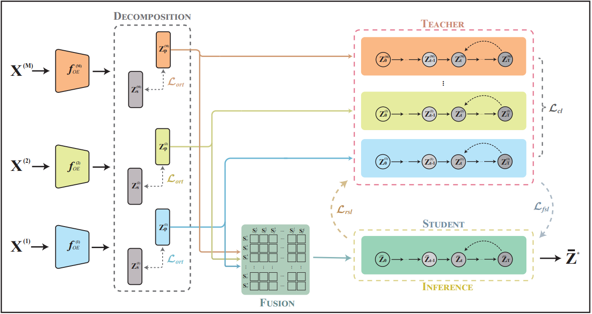

# Reciprocal Supervised Diffusion Model for Multi-view Generative Clustering

## Requirements

pytorch>=2.1.1 

numpy>=1.26.4

scikit-learn>=1.7.2

einops>=0.7.0

ema_pytorch>=0.7.7

tqdm>=4.65.0

## Training

To train a new model, run:

~~~bash
python main.py --data-name Cub --seed 1 --batch-size 512 --epochs 1000 --learning-rate 0.00001
~~~

